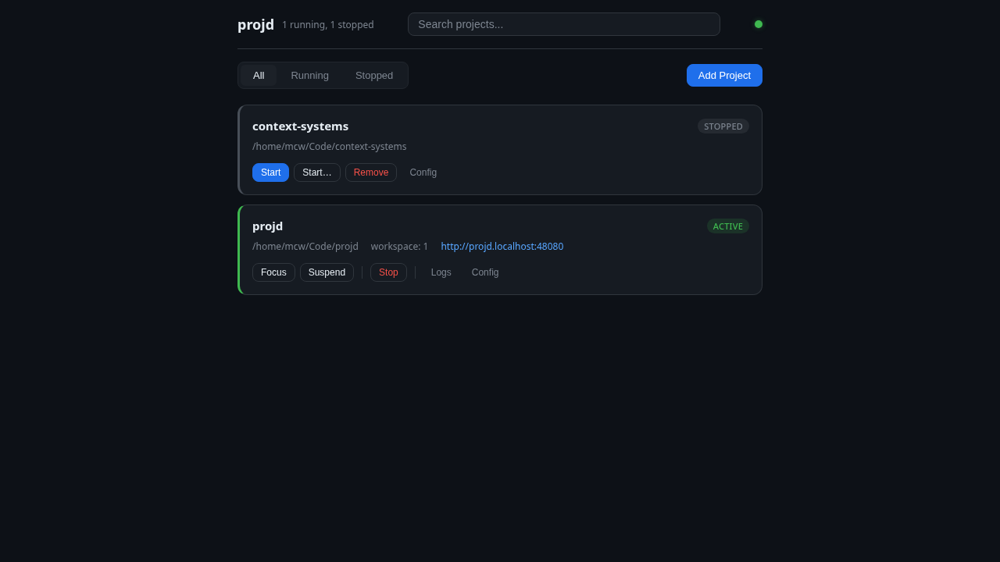
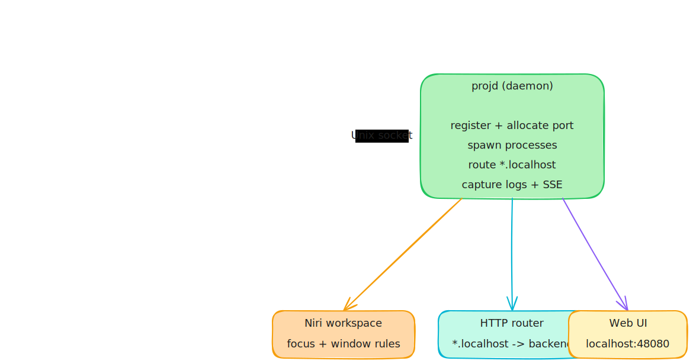
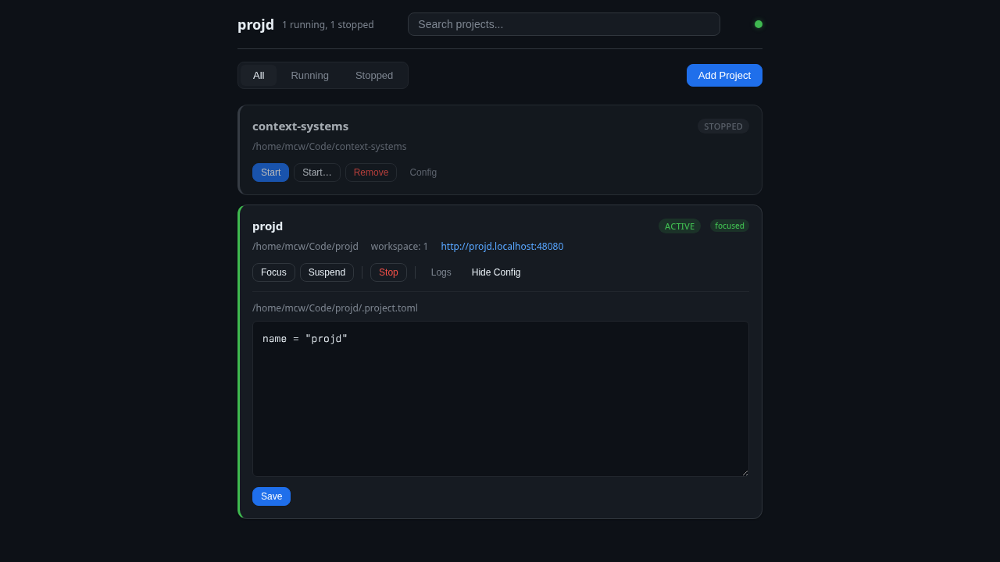
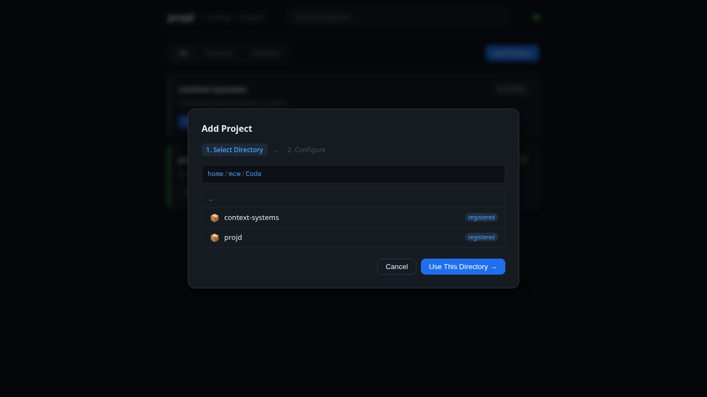

# projd

**One command to start, switch, and manage your project environments on [Niri](https://github.com/YaLTeR/niri).**

`projd` is a daemon + CLI that turns each project directory into a self-contained runtime environment: dedicated workspace, dev server with automatic port allocation, browser with isolated profile, editor, background agents, and a local `.localhost` router -- all from a single TOML file.

```bash
cd ~/Code/my-app
proj up          # start everything: server, browser, editor, workspace
proj focus api   # jump to another project's workspace instantly
proj status      # see what's running
```



## Install

Requires Rust toolchain and [mise](https://mise.jdx.dev).

```bash
git clone https://github.com/anthropics/projd.git
cd projd
mise run bootstrap
```

This compiles and installs `proj`, `projd`, and `proj-tui` into `~/.cargo/bin`.

For Niri workspace integration (keybindings + status bar helper):

```bash
proj install niri
```

## Quick start

**1. Start a project from its directory:**

```bash
cd ~/Code/frontend
proj up
```

This auto-creates `.project.toml` if missing, starts the daemon if needed, registers the project, allocates a port, and -- on Niri -- assigns a workspace and focuses it.

**2. Add a dev server and browser:**

Edit `.project.toml`:

```toml
name = "frontend"

[server]
command = "npm run dev"
port_env = "PORT"

[browser]
urls = ["${PROJ_ORIGIN}"]
```

Then restart:

```bash
proj down frontend
proj up
```

The daemon allocates a port (3001+), injects it as `$PORT`, starts your server, waits for it to be ready, then opens `http://frontend.localhost:48080` in an isolated browser profile.

**3. Switch between projects:**

```bash
proj switch api       # focus the api workspace
proj focus frontend   # jump back to frontend + surface its windows
proj list             # see all registered projects
```

## What problem does projd solve?

Developers working on multiple projects simultaneously deal with:

- **Repetitive startup rituals** -- open terminal, cd, start server, open browser, navigate to URL, open editor -- repeated for every project, every session
- **Port collisions** -- "is my API on 3000 or 3001 today?"
- **Window chaos** -- browser tabs and terminals from different projects mixed together across workspaces
- **Lost context** -- a process crashes; which project was it? where do you go to fix it?

projd fixes all of this. Each project gets:

| What | How |
|------|-----|
| Deterministic port | Auto-allocated from 3001+, persisted across restarts |
| Local hostname | `<project>.localhost` via built-in HTTP router on port 48080 |
| Isolated browser | Per-project Chromium/Firefox profile, no cookie bleed |
| Niri workspace | Auto-configured workspace with window routing rules |
| Process lifecycle | Server, agents, terminals, editor -- started, monitored, logged |
| Desktop notifications | Process failures include project name + `proj focus <name>` hint |
| Machine-readable state | `proj status --json` for Waybar/Quickshell integration |

## How it works



**Components:**

- **`projd`** -- Background daemon. Manages the project registry, spawns/monitors processes, maintains the HTTP host router, serves the web UI, and broadcasts state changes via SSE.
- **`proj`** -- CLI client. Sends commands to the daemon over a Unix socket. Auto-starts the daemon on first use.
- **`proj-tui`** -- Terminal dashboard with vim-like keybindings for monitoring all projects.
- **Web UI** -- Dashboard at `http://localhost:48080` for managing projects from the browser.

## Project configuration

Each project is defined by a `.project.toml` in its root directory.

### Minimal

```toml
name = "my-app"
```

Running `proj up` in a directory with just this will register the project and allocate a port. The name defaults to the directory name if omitted.

### Full example

```toml
name = "app-suite"
workspace = "3"

[server]
command = "npm run dev"
port_env = "PORT"
ready_pattern = "ready on"
cwd = "."

[[agents]]
name = "indexer"
command = "node agent.js"

[[terminals]]
name = "shell"

[editor]
command = "code"
args = ["."]

[browser]
urls = ["${PROJ_ORIGIN}", "https://github.com/org/app"]
isolate_profile = true

depends_on = ["../shared-api"]
```

### Template variables

These are available in all command strings and URLs:

| Variable | Value |
|----------|-------|
| `${PORT}` | Allocated backend port (3001+) |
| `${PROJ_NAME}` | Project name |
| `${PROJ_HOST}` | `<project>.localhost` |
| `${PROJ_ORIGIN}` | `http://<project>.localhost:48080` |
| `${PROJ_ROUTER_PORT}` | Router port (default 48080) |

### Server readiness

When `server.ready_pattern` is set, the daemon watches stdout for a matching line before launching the browser. This prevents opening a blank page before the server is ready.

### Browser isolation

When `browser.isolate_profile = true` (the default), projd auto-adds per-project profile flags for Chromium and Firefox family browsers. Each project gets its own cookies, localStorage, and session state.

The browser command resolves from: `browser.command` > `$PROJD_BROWSER_CMD` > `$BROWSER` > system default.

### Dependencies

`depends_on` accepts paths to other project directories. The daemon starts dependencies first and waits for their servers to be ready before starting the dependent project.

```toml
depends_on = ["../shared-api", "../auth-service"]
```

## CLI reference

```
proj init                                    Create starter .project.toml
proj up [path|name] [--workspace <ws>]       Register + start a project
proj down <name>                             Stop a project
proj list                                    List all registered projects
proj status [name] [--json] [--watch]        Show lifecycle state
proj logs <name> [process] [--tail N]        Show captured process logs
proj switch <name>                           Switch active project (focus workspace)
proj focus <name>                            Focus workspace + surface windows
proj suspend <name>                          Suspend a project
proj resume <name>                           Resume a suspended project
proj peek <name>                             Inspect state without changing focus
proj daemon start|stop|status                Manage the daemon
proj install niri                            Install Niri integration
proj-tui                                     Interactive terminal dashboard
```

`proj up <name>` resolves projects in this order:
1. Already-registered project name
2. Directories in `$PROJ_PROJECT_ROOTS` (colon-separated)
3. `~/Code/<name>`

## Web UI

The daemon serves a dashboard at `http://localhost:48080` with real-time status updates via SSE.



Features: start/stop/focus/suspend projects, browse and add project directories, edit `.project.toml` in-place, view logs, and filter by state.



## Status bar integration

For Waybar, Quickshell, or custom dashboards:

```bash
# One-shot JSON status
proj status --json

# Streaming (newline-delimited JSON, updates every second)
proj status --json --watch --interval-ms 1000
```

Output shape:

```json
{"projects":[{"project":{"name":"frontend","path":"/home/me/Code/frontend","workspace":"frontend","port":3001},"state":"active","focused":true}]}
```

`proj install niri` also installs a `status-watch.sh` helper for this.

## Niri integration

projd manages a section of your Niri config (`~/.config/niri/config.kdl`) between markers:

```
// === PROJD MANAGED START (do not edit) ===
// ... workspace declarations and window rules ...
// === PROJD MANAGED END ===
```

Everything outside these markers is untouched. The managed section auto-updates when projects are registered or removed.

## Development

```bash
mise run build          # Type-check
mise run build-link     # Full compile
mise run test-run       # Run tests
mise run test-integration  # Niri workflow integration tests
mise run tui            # Run terminal dashboard
mise run daemon         # Run daemon in foreground
```

See `AGENTS.md` for contributor workflow details.

### TUI keybindings

| Key | Action |
|-----|--------|
| `j`/`k` or arrows | Move selection |
| `g` / `G` | Jump to first/last |
| `Enter` | Switch to selected project |
| `p` | Peek project state |
| `l` | Load logs |
| `f` | Toggle log follow mode |
